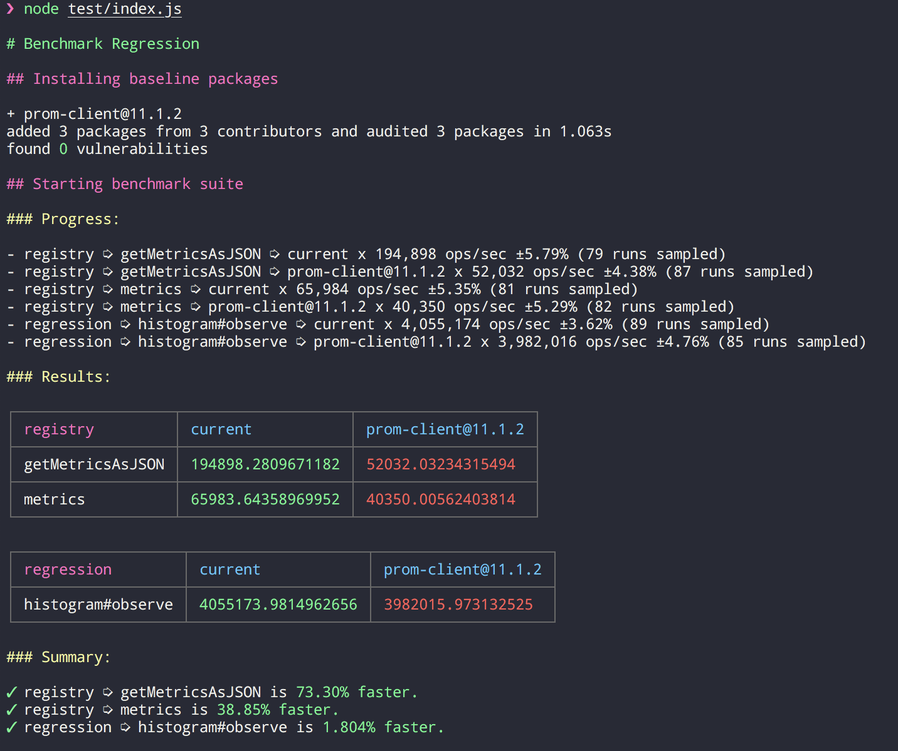

# `@clevernature/benchmark-regression`

Generates performance regression tests using benchmarkjs.

## Code

```js
const createRegressionBenchmark = require('@clevernature/benchmark-regression');
const currentClient = require('..');

const benchmarks = createRegressionBenchmark(currentClient, ['prom-client@11.1.2']);

benchmarks.suite('registry', (suite) => {
    suite.add(
        'getMetricsAsJSON',
        (client, { registry }) => registry.getMetricsAsJSON(),
        { setup }
    );
    suite.add(
        'metrics',
        (client, { registry }) => registry.metrics(),
        { setup }
    );
});

benchmarks.add(
    'histogram#observe',
    (client, { histogram }) => histogram.observe(1, { a: 1, b: 1 }),
    { setup }
);

benchmarks.run().catch(err => {
    console.error(err.stack);
    process.exit(1);
});

function setup(client) {
    const registry = new client.Registry();

    const histogram = new client.Histogram({
        name: 'histogram',
        help: 'histogram',
        labelNames: ['a', 'b'],
        registers: [registry]
    });

    histogram.observe(1, { a: 1, b: 1 });

    return {registry, histogram};
}
```

## Results


